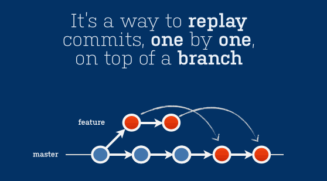

# Rewriting History

## Prerequisites

* Git (2.x)
* (Optional) hub - https://github.com/github/hub
* Access to the fheng/git-tutorial repo (ask if you don't have)

Clone this repository

```bash
# Don't fork
git clone git@github.com:fheng/git-tutorial.git
```

## Overview

Why rewrite history?

* Git is not only a source control tool, it is also a communication tool
    * Order of commits, logical grouping, good commit messages help to communicate changes
    * Think of the person reviewing your PRs as a potential axe-murderer. Axe murderers hate fix-up commits.
* Golden rule: **Never** rewrite history on shared/public trees

## Rebasing

Rebasing and Merging are two methods that achieve the same goal - the integration of changes from one branch into another branch





### Practical

```bash
cd git-tutorial # From earlier
git fetch
git checkout rebase
# The rebase branch was branched from master a while ago
# It's out of date (master has moved on)
# And there's bad commits in our history that we're going to fixup
git log --pretty=oneline # take a look at the commits we've got
# https://github.com/fheng/git-tutorial/pull/3
# First, lets interactively rebase our last 4 commits
git rebase -i HEAD~4 # Note the lack of a branch
# Fix up the commits - think about re-ordering or (s)quashing
# the version bumps and (r)eword the commit messages. 
# Also, delete commits that are of no value
git rebase origin/master

# Alternatively:
# We can do both a history rewrite and a rebase via:
git rebase -i origin/master
```

Next, we're going to have a rebase race


```bash
# branch from the existing `race` branch
git checkout -b your-name-race origin/race


# Each of you!!!!!
# Add your name to to `models/append.json` as fast as you can, and commit it
#
# e.g.
#   vi models/append.json
#     add your name
#   git add models/append.json
#   git commit -m "Adding <Your Name>"

# Send a PR back to the `race` branch
git push origin your-name-race

# This command will work if you have 'hub' installed
# Otherwise, create a PR from the Github interface at 
# https://github.com/fheng/git-tutorial/compare
git pull-request -b race -m "Adding <Your Name>"

# But wait, there's more - the race branch is updating frequently :)
# http://bob.feedhenry.net:8080/job/git-tutorial-race/
# Get your PRs merged
```